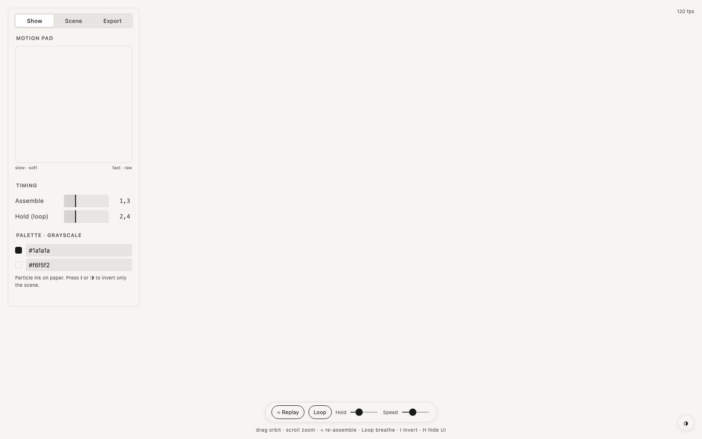

  

<h1 align="center">Particles 3D</h1>

  A WebGL2 cloud of up to 300,000 particles 
  one HTML file · runs in the browser · no install · free and open source

  <a href="https://robvagin.github.io/particles-3d/"><b>Open Particles 3D</b></a> ·
  <a href="#run-it">Run it</a> ·
  <a href="#more-tools">More tools</a>

---

A cloud that assembles itself, holds and breathes out again. Plain WebGL2, no libraries.

## What it does

- **Up to 300,000 particles** on a desktop (90,000 on phones)
- **Home shapes:** sphere, ball, box, torus and disc; presets cloud, shell, swirl and ribbon
- **Show:** assemble, hold and loop, with a motion pad for speed and character
- **Grayscale palette** with a one-key invert
- **Record** the canvas to WebM, export PNG and a JSON config

## Run it

Open [robvagin.github.io/particles-3d](https://robvagin.github.io/particles-3d/), or download `index.html` and open it from your disk. It is the whole tool: no build step, no dependencies, no network. Press **H** to hide the panel.

## Made by a designer

I'm a designer. I build small tools like this for my own work, with AI agents: I make the decisions, Claude Code writes the code. The panels follow one grammar across the whole set.

Take it if you want it.

## More tools

- [Particle Dance](https://github.com/robvagin/particle-dance) · particles that dance along patterns and 3D forms
- [Murmur](https://github.com/robvagin/murmur-vj) · a VJ visualizer: circles, triangles and squares that move to your music
- [Orbital](https://github.com/robvagin/orbital) · data as orbits, axes or a bending mesh
- [Metaballs](https://github.com/robvagin/metaballs) · soft masses that merge, split and leave holes
- [Halftone Cloud](https://github.com/robvagin/halftone-cloud) · images rebuilt as a halftone of flying shapes
- [Logomachine](https://github.com/robvagin/logomachine) · seeded generative marks: one seed, one pattern, always
- [Motion Primer](https://github.com/robvagin/motion-primer) · bodies with behaviors: swarm, pack, magnet, orbit, fall, scatter
- [Guilloche](https://github.com/robvagin/guilloche) · guilloche line work: rosettes, weaves, tori and Chladni figures
- [Unison](https://github.com/robvagin/unison) · metronomes on one board falling into unison
- [Pixel Ring](https://github.com/robvagin/pixel-ring) · rings drawn in pixels
- [Motion Pad](https://github.com/robvagin/motion-pad) · one pad for the character of motion

## License

[MIT](LICENSE) © 2026 Robert Vagin
